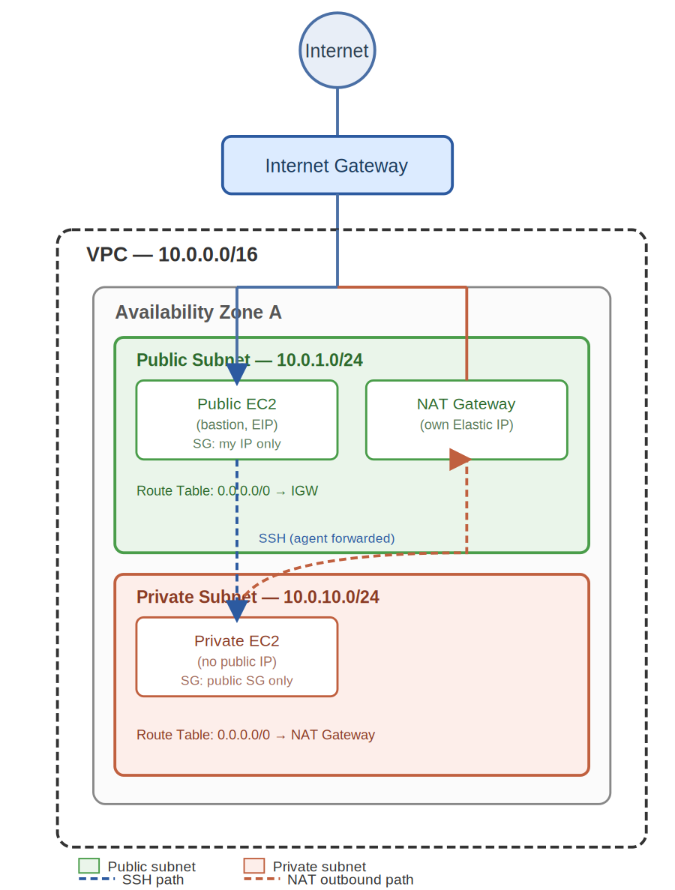
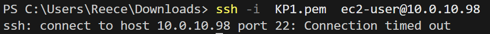
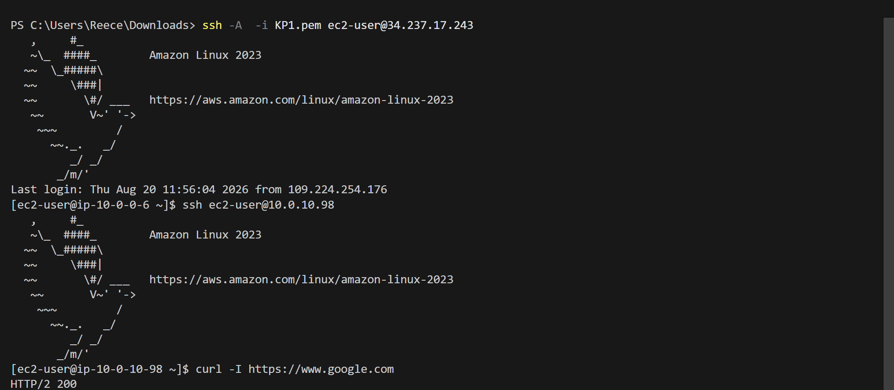

# Bastion Host + Private Network Setup

Create a custom VPC with one public and one private subnet, set up the correct routing for internet access, and deploy EC2 instances across them.

## Architecture

## Components

VPC - `10.0.0.0/16`
Public subnet - `10.0.0.0/28`, route table `0.0.0.0/0 → Internet Gateway`
Private subnet - `10.0.10.0/24`, route table `0.0.0.0/0 → NAT Gateway`
Internet Gateway - attached to the VPC for public subnet access
NAT Gateway - sits in the public subnet with its own Elastic IP, gives the private subnet outbound-only access
Bastion EC2 - public subnet, Elastic IP, SG allows SSH from home IP only
Private EC2 - private subnet, no public IP, SG allows traffic from the bastion's SG only

## Result

- Setup VPC featuring two subnets consisting of their own public and private IP, Internet gateway for public access and NAT gateway for private IP internet interaction; configured using route tables.

- Allow SSH only from home IP, private EC2 only allows interaction from instances within the VPC.

- Access to private EC2 via bastion using SSH agent forwarding (`ssh -A`); private key never copied onto the bastion itself.

## Notes

- Direct SSH to the private IP (`10.0.10.98`) from a local machine times out; expected, the private subnet has no route reachable from outside the VPC. Access goes through the bastion instead.

markdown

Screenshots

- Outbound access from the private EC2 confirmed via the NAT Gateway; `curl -I https://www.google.com` returns `HTTP/2 200`.
- Private EC2's inbound SG rule references the bastion's SG directly rather than a hardcoded IP.
