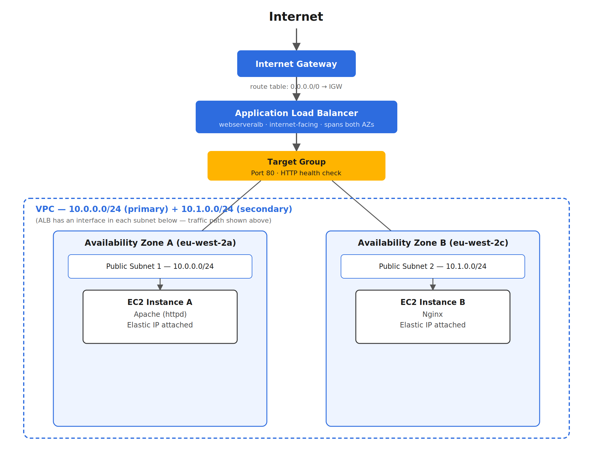
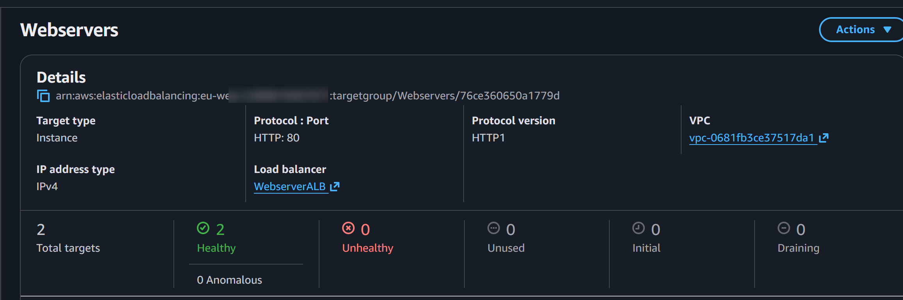
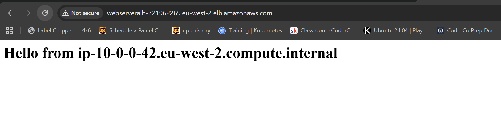
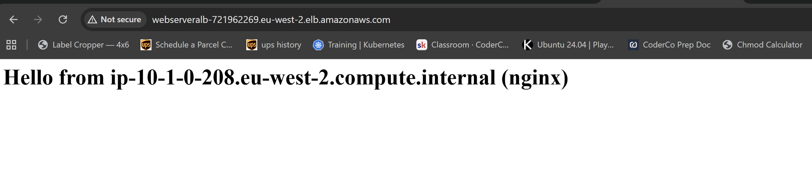

# ALB + Web Server Deployment

Deploy two EC2 instances behind an ALB. The ALB must handle all incoming traffic. EC2 instances should not be accessible directly from the internet.

## Architecture

## Components

VPC - `10.0.0.0/24` (primary) + `10.1.0.0/24` (secondary CIDR)

Public subnet 1 - `10.0.0.0/24`, `eu-west-2a`

Public subnet 2 - `10.1.0.0/24`, `eu-west-2c`

Internet Gateway - attached to the VPC

Route table - `0.0.0.0/0 → Internet Gateway`, associated with both subnets

EC2 instance A - Apache (httpd), Elastic IP

EC2 instance B - Nginx, Elastic IP

Target group - port 80, HTTP health check on root path

ALB - `webserveralb`, internet-facing, spans both AZs

## Result

Deployed a load balancer which points to two ec2 instances to host different webpages. HTTP traffic is only allowed through the load balancer instead of directly to the instances, health checks on the root paths for both. Webpages deploy on startup with script.

## Notes

- VPC primary CIDR (`10.0.0.0/24`) leaves no room for a second subnet; added a secondary CIDR (`10.1.0.0/24`) to fit one.

- `10.0.1.0/24` rejected as a secondary CIDR; VPC CIDR restriction blocks anything in `10.0.0.0/16` once the primary CIDR falls inside `10.0.0.0/15`. Used `10.1.0.0/24` instead.

- ALB creation greyed out the VPC in the subnet selector; caused by no Internet Gateway attached, not by AZ count or IP address type. Attached IGW, added route table, associated with both subnets, resolved it.

- `user-data` script failed on first boot (`dnf install httpd` timed out); subnet had no route to the IGW yet at boot time, so the instance had no outbound path regardless of public IP. Installed manually via SSH after fixing routing; for future deployments, IGW/route table need to exist before instance launch, since `user-data` only runs once.

- Elastic IP assigned manually since the subnet wasn't set to auto-assign a public IPv4 address; fixed by enabling that setting on the subnet for future launches.

## Verification

Screenshots

- Two healthy web servers

-Same domain reaching the different servers via the load balancer

