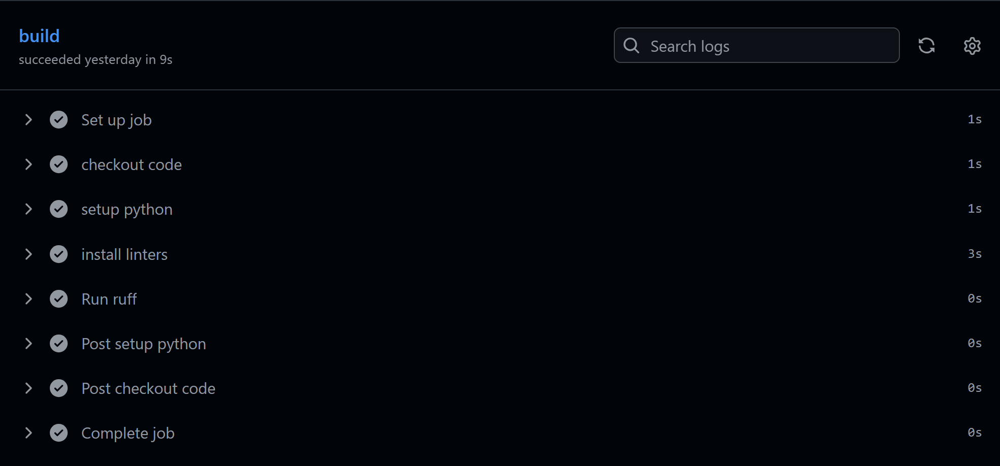
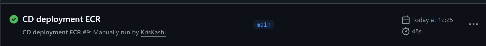
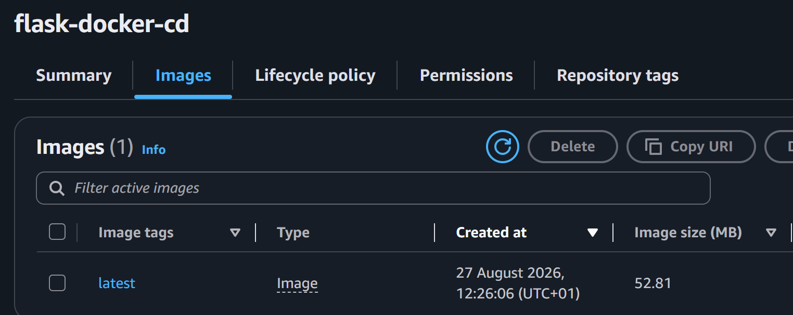

# CI / CD

This repo contains projects relating to mastering CI/CD fundamentals.


## Project Structure
```
DevOps-learning/
├── .github/
│   └── workflows/
│       ├── ci.yml
│       └── cd-ecr.yml
├── cicd/
│   ├── task1/
│   │   ├── app.py
│   │   └── Dockerfile
│   └── task2/
│       ├── app.py
│       ├── Dockerfile
│       ├── docker-compose.yml
│       └── nginx.conf
├── media/
│   ├── FIRSTDEPLOYMENT.png
│   ├── ECR_SUCCESS_CD.png
│   └── ECR_IMAGE.png
└── README.md
```

## Topics Covered


- GitHub actions & YAML file structures

- Typical workflows, triggers on push,pull, manual dispatch

-  Matrix builds & parallel testing

- Using Github secrets and environment variables

- Creating and using custom github actions

- Deploying to different environments ; development, staging , production

- Debugging failed pipelines

- OIDC authentication to AWS 


## Projects

### Automated deployment and containerisation of a simple python app

- On a push to the repo, this pipeline checks out the code from the python app, lints it using ruff, and upon passing builds and runs a docker image of the application.

this demonstrates the fundemental process of CI/CD, integrating and testing code changes and then updated deployment to a docker image.




### Deployment of a docker container to Amazon ECR

- This project takes an application I built, (Docker compose multi-container visit counter website) , detects changes and lints the python flask app, makes sure the orchestration runs and then builds and deploys the container to amazon ECR for retrival.
Uses OIDC for seamless short lived authentication with concept of least priviledge.






## Key learnings

- Multiple pipelines can be run simaltaneously under .github/workflows which is the main arena for CICD using github actions

- OIDC can be used, giving permissions to the repository root itself to access only what the pipeline needs to function. Both efficient and best security practice.

- Github Actions runs as its own virtual machine for every workflow action.


# Troubleshooting

- During July 2026 Github pushed an update to its own OIDC token auth, requiring the repository and organisation ID to be provided within the subject claim format. Running the old format, which is referenced in guides would produce an error:

`Not authorized to perform sts:AssumeRoleWithWebIdentity`

Solution:

### old format (what most trust policy examples/tutorials still show):
repo:OWNER/REPO:*

### new format (what GitHub actually issues for repos created after July 15, 2026):
repo:OWNER@OWNER_ID/REPO@REPO_ID:*


- Docker uses image caching locally, so its best practice to build it within the pipeline because adding the image as reference, as you would when testing locally, with no image prebuilt would produce an error trying to pull the image from dockerhub.