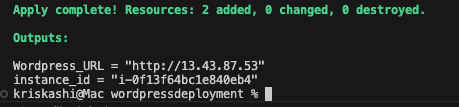
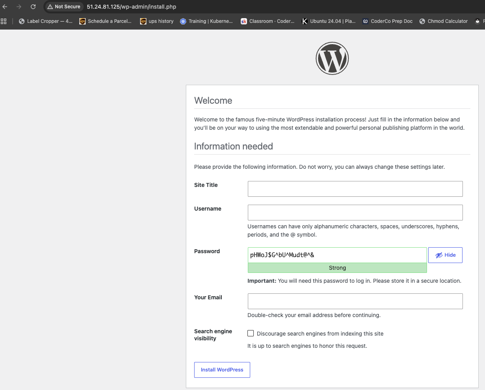
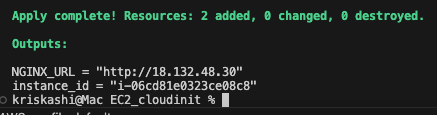
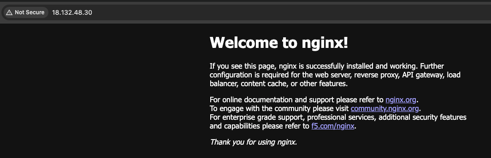

# Terraform

This repository contains my progression and projects regarding terraform, from a simple config to a modularised remote state setup through multiple hands on projects.

# Structure

terraform/

├── provider.tf                  # AWS provider + S3 remote backend config

├── main.tf                      # Root module, calls modules/ec2

├── modules/

│   └── ec2/                     # Reusable EC2 module

├── wordpressdeployment/         # Assignment 1: full LAMP + WordPress via Terraform

└── EC2_cloudinit/                # Assignment 2: EC2 + cloud-init YAML

# Projects 

## Wordpress deployment - 

Fully automated wordpress deployment which provisions an EC2 instance, configures its security rules to open HTTP traffic for the internet and SSH through my IP, and then use a startup script to install and configure LAMP dependencies so that wordpress can be fully functional with a database.

### Terraform Apply

### WordPress Install Screen

## NGINX Cloudinit -

Uses terraform to deploy an EC2 instance and an alternative startup script in the form of a cloudinit YAML file to setup an nginx webpage. Cloudinit is more declarative as we can reference things such as packages directly instead of the install commands.

Same pattern — just point at the EC2_cloudinit/screenshots/ folder instead:

markdown
## Terraform Apply

## NGINX Welcome Page

# What I learned 

- Infrastructure as code, declarative management and why we use it over ClickOps

- Terraform workflow, Plan, apply, written using HCL ; Structure around resources and providers

- Terraform deployment of AWS resources and databases (EC2,S3, Security group & VPC,)

- Terraform Remote state backend vs local state file ; why its used and advantages, native state locking 

- Secure management of secrets and principles to make the code more 'DRY' using  terraform variables and tfvars files.

- configuring servers that automate the full deployment process using startup scripts via cloudinit and a setup template script (template allows you to pass in variabels compared to normal script) 

# Troubleshooting

- When working with variables its important to replicate the same style/case pattern as between multiple references it can get confusing and cause errors if different.

- User data silently failed due to not passing in the required variables, had to manually ssh in and check logs

# Next steps

- Explore external secrets management using  AWS Secrets manager 

